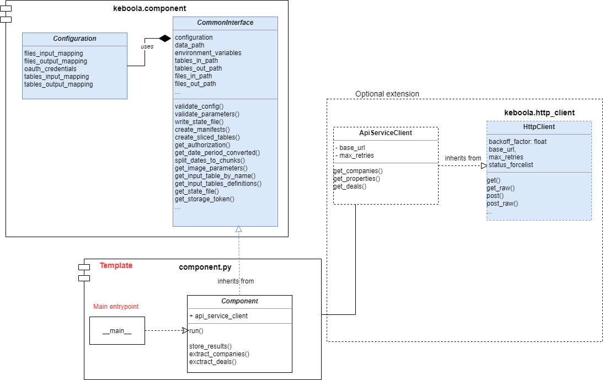
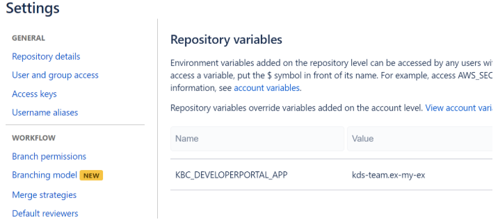

- [KBC Component Python template](#kbc-component-python-template)
- [Recommended component architecture](#recommended-component-architecture)
  - [Architecture using the template](#architecture-using-the-template)
  - [Example component](#example-component)
- [Creating a new component](#creating-a-new-component)
- [Setting up the CI](#setting-up-the-ci)
  - [Default stage](#default-stage)
  - [Master stage](#master-stage)
  - [Tagged commit stage](#tagged-commit-stage)
- [GELF logging](#gelf-logging)
- [Development](#development)
  - [Testing](#testing)
- [Integration](#integration)


# KBC Component Python template

Python template for KBC Component creation. Defines the default structure and GitHub Actions CI scripts for automatic deployment.

Use as a starting point when creating a new component.

Example uses the [keboola.component](https://pypi.org/project/keboola.component) library providing useful methods for KBC related tasks
and boilerplate methods often needed by components, for more details see [documentation](https://github.com/keboola/python-component/blob/main/README.md)


# Recommended component architecture

It is recommended to use the [keboola.component library](https://pypi.org/project/keboola.component)
for each component. The major advantage is that it reduces the boilerplate code replication, the developer can focus on core component logic
and not on boilerplate tasks. If anything is missing in the library, please fork and create a pull request with additional changes,
so we can all benefit from it.

**Base components on [CommonInterface](https://htmlpreview.github.io/?https://raw.githubusercontent.com/keboola/python-component/main/docs/api-html/component/interface.html#keboola.component.interface.CommonInterface)**

- No need to write configuration processing and validation code each time.
- No need to set up logging environment manually.
- No need to write code to store manifests, write statefile, retrieve dates based on relative period, and many more.
- The main focus can be the core component logic, which increases the code readability for newcomers.

**Base Client on [HttpClient](https://pypi.org/project/keboola.http-client/)**

- No need to write HTTP request handling over and over again.
- Covers basic authentication, retry strategy, headers, default parameters.


## Architecture using the template




## Example component

This template contains a functional hello-world component example that produces valid results.
It is advisable to use this structure as a base for new components. Especially the `component.py` module, which should only
contain the base logic necessary for communication with KBC interface, processing parameters, collecting results
 and calling targeted API service methods.


# Creating a new component

Clone this repository into a new folder and remove git history

```bash
git clone PATH_TO_YOUR_REPO my-new-component
cd my-new-component
git add .
git commit -m 'initial'
git push -u origin master
```

# Setting up the CI

- Check that the [workflows are enabled](https://docs.github.com/en/actions/managing-workflow-runs/disabling-and-enabling-a-workflow).
  The actions are present in `.github/workflows/` folder.
- Set `KBC_DEVELOPERPORTAL_APP` env variable (dev portal app id)

If not set at the account level, set also other required dev portal env variables:

- `KBC_DEVELOPERPORTAL_PASSWORD` - service account password
- `KBC_DEVELOPERPORTAL_USERNAME` - service account username
- `KBC_DEVELOPERPORTAL_VENDOR` - dev portal vendor
- `KBC_STORAGE_TOKEN` - (optional) in case you wish to run KBC automated tests



The script execution is defined in three stages:


## Default stage

This script is executed on push to any branch except the main branch. It executes basic build and code quality steps. Following steps are performed:
Build docker image
Execute flake8 lint tests
Execute python unittest
(Optional) Push image with tag :test into the AWS repository for manual testing in KBC
If any of the above steps results in non-zero status, the build will fail. It is impossible to merge branches that fail to build into the main branch.


## Master stage

This script is executed on any push or change in the main branch. It performs every step as the default stage. Additionally,
the `./scripts/update_dev_portal_properties.sh` script is executed.
This script propagates all changes in the Component configuration files (component_config folder) to the Developer Portal.
Currently these Dev Portal configuration parameters are supported:

 - `configSchema.json`
 - `configRowSchema.json`
 - `component_short_description.md`
 - `component_long_description.md`

The choice to include this script directly in the main branch was made to simplify ad-hoc changes of the component configuration parameters. For instance, if you wish to slightly modify the configuration schema without affecting the code itself, it is possible to simply push the changes directly into the master and these will be automatically propagated to the production without rebuilding the image itself. Solely Developer Portal configuration metadata is deployed at this stage.


## Tagged commit stage

Whenever a tagged commit is added or tag is created, this script gets executed. This is a deployment phase, so a successful build results in new code being deployed in KBC production.
At this stage all steps present in the default and master stage are executed. Additionally,
`deploy.sh` script that pushes the newly built image / tag into the ECR repository and KBC production is executed.
The deploy script is executed only after all tests and proper build steps passed.
Moreover, the `deploy.sh` script will be executed **only in the main branch**. In other words if you create a tagged commit in another branch, the pipeline gets triggered but deployment script will fail, because it is not triggered within the main branch. This is to prevent accidental deployment from a feature branch.


# GELF logging

The template automatically chooses between STDOUT and GELF logger based on the Developer Portal configuration.

To fully leverage the benefits such as outputting the `Stack Trace` into the log event detail (available by clicking on the log event)
log exceptions using `logger.exception(ex)`.

**TIP:** When the logger verbosity is set to `verbose` you may leverage `extra` fields to log a detailed message in the log event by adding extra fields to you messages:

```python
logging.error(f'{error}. See log detail for full query. ',
                         extra={"failed_query": json.dumps(query)})
```

Recommended [GELF logger setup](https://developers.keboola.com/extend/common-interface/logging/#setting-up) (Developer Portal) to allow debug mode logging:

```json
{
  "verbosity": {
    "100": "normal",
    "200": "normal",
    "250": "normal",
    "300": "verbose",
    "400": "verbose",
    "500": "camouflage",
    "550": "camouflage",
    "600": "camouflage"
  },
  "gelf_server_type": "tcp"
}
```


# Development

This example contains runnable container with simple unit test. For local testing it is useful to include `data` folder in the root
and use docker-compose commands to run the container or execute tests.

If required, change local data folder (the `CUSTOM_FOLDER` placeholder) path to your custom path:

```yaml
    volumes:
      - ./:/code
      - ./CUSTOM_FOLDER:/data
```

Clone this repository, init the workspace and run the component with following command:

```
git clone PATH_TO_YOUR_REPO my-new-component
cd my-new-component
docker-compose build
docker-compose run --rm dev
```

Run the test suite and lint check using this command:

```
docker-compose run --rm test
```


## Testing

The preset pipeline scripts contain sections allowing pushing testing image into the ECR repository and automatic
testing in a dedicated project. These sections are by default commented out.

The GitHub Actions workflows in `.github/workflows/` handle testing and deployment automatically.


# Integration

For information about deployment and integration with KBC, please refer to the [deployment section of developers documentation](https://developers.keboola.com/extend/component/deployment/)